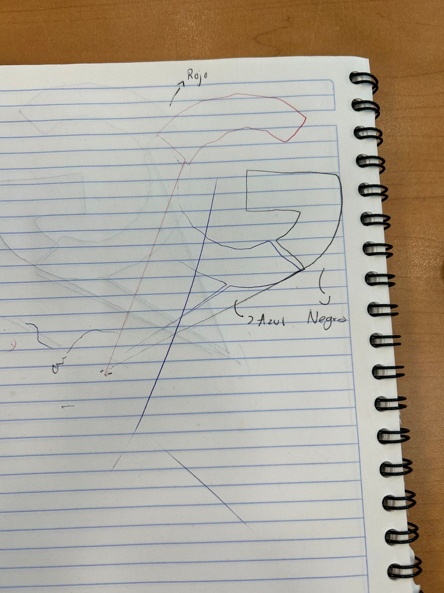

# Lite 6 Multicolor Robotic Drawing System

<p align="center">
  
  <br>
  <em>UFactory Lite 6 Robotic Arm</em>
</p>

<p align="center">
  
  <br>
  <em>Final Multicolor Drawing Result</em>
</p>

[](https://www.python.org/)
[](https://github.com/AldonDC/lite6-multicolor-robotics)
[](https://www.ufactory.cc/lite-6-robotic-arm/)

## Project Overview
This repository contains the technical implementation of an advanced robotic drawing system. The project orchestrates a UFactory Lite 6 collaborative arm to execute high-precision trajectories in multiple chromatic layers, utilizing a customized G-code parsing engine and the xArm Python SDK.

## System Architecture

### 📁 Directory Structure
*   `scripts/`: Core kinematic control and G-code interpreter logic.
    *   `colors-draw.py`: Main multicolor sequence controller.
    *   `robot_draw.py`: Base single-color execution script.
*   `gcode/`: Processed numerical control files (.ngc) exported from vector design software.
*   `assets/images/`: Technical documentation assets and source image references.
*   `latex/`: Academic report source code (IEEE standard compliant).
*   `xArm-Python-SDK/`: Local hardware abstraction layer for robot communication.

## Technical Workflow
1.  **Vector Synthesis**: Design segmentation using layers in Inkscape.
2.  **Path Generation**: Extraction of G-code paths (.ngc) optimized for the Lite 6 working envelope.
3.  **Kinematic Execution**: Real-time trajectory processing via `colors-draw.py`, featuring manual tool change synchronization and Z-axis calibration.

## Installation and Deployment

### Environment Setup
Ensure the Lite 6 robot is reachable via the local network and the Python environment is configured:
```bash
# Clone the repository
git clone https://github.com/AldonDC/lite6-multicolor-robotics.git
cd lite6-multicolor-robotics

# Verify network connectivity with the Lite 6 controller
ping <ROBOT_IP_ADDRESS>
```

### Execution
To initiate the multi-layer drawing sequence:
```bash
python3 scripts/colors-draw.py
```

### Video Evidence
Watch the robot in action: [Execution Video](assets/videos/execution_video.mp4)

## Abstract and Research
The project validates the use of Digital Twins and collaborative robotics in precision manufacturing scenarios. By simulating the assembly and drawing process, we achieve a significant reduction in collision risk and material waste.

---
**Developer**: Alfonso Solis Diaz
**Affiliation**: Tecnológico de Monterrey [IRS]
